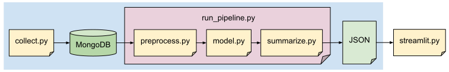

# Mastodon topic modeling

This project implements an end-to-end pipeline for discovering and summarizing popular topics on the Mastodon social network. It combines BERTopic for topic modeling with large language models to generate interpretable summaries, providing daily insights into what the Mastodon community is discussing.

View the results at [mastodon-topics.streamlit.app](https://mastodon-topics.streamlit.app/)

View the development notebooks at [github.com/terencicp/social-network-topic-modeling](https://github.com/terencicp/social-network-topic-modeling)

## Architecture

The pipeline consists of three main components:
- **pipeline/collect.py**: Runs continuously to collect Mastodon posts
- **pipeline/run_pipeline.py**: Runs once daily to generate topic summaries
- **app/streamlit.py**: Used to visualize the results of run_pipeline.py

The main files are:

**collect.py** - Data collection
   - Fetches public posts from mastodon.social API
   - Anonymizes data and stores it in MongoDB

**preprocess.py** - Data preprocessing
   - Filters english-language posts
   - Aggregates textual content from multiple fields

**model.py** - Topic modeling
   - Generates Gemma-300m embeddings
   - Trains BERTopic models with optimized parameters

**summarize.py** - LLM summarization
   - Selects top topics by popularity
   - Generates structured summaries using Qwen3 8b

**streamlit.py** - Streamlit app
   - Displays topic summaries

## Requirements

### System dependencies
- Python 3.11
- MongoDB
- Ollama

### Python dependencies
- Pipeline: pipeline/requirements.txt
- Streamlit: app/requirements.txt

### Environment variables
- MASTODON_HASHING_KEY for data anonymization
- HUGGINGFACE_TOKEN from your HuggingFace account for Gemma embeddings

## Acknowledgments

This project builds upon the work of several amazing open-source projects and research teams:

- **[Mastodon](https://joinmastodon.org/)**: decentralized social network
- **[Gemma embeddings](https://ai.google.dev/gemma)**: embedding models from Google DeepMind
- **[BERTopic](https://maartengr.github.io/BERTopic/)**: topic modeling framework by Maarten Grootendorst
- **[Qwen3](https://qwen.ai/)**: LLM from Alibaba Cloud

Please make a donation to Mastodon if you use its API to offset the server costs.

## Contact

LinkedIn: [Terenci Claramunt](https://www.linkedin.com/in/terenci/)

This project was developed as part of my Applied Data Science Degree thesis.

Feel free to reach out for questions about the methodology or implementation.
